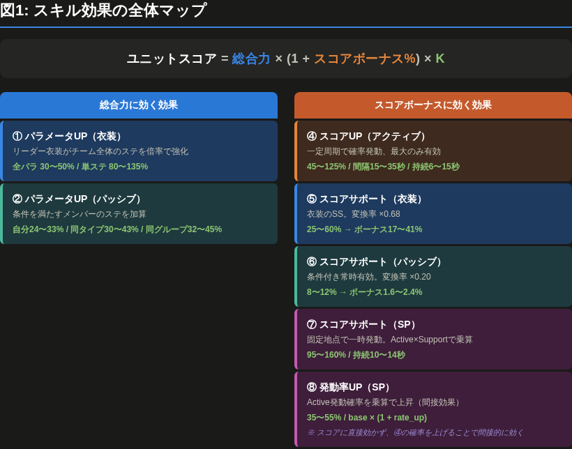
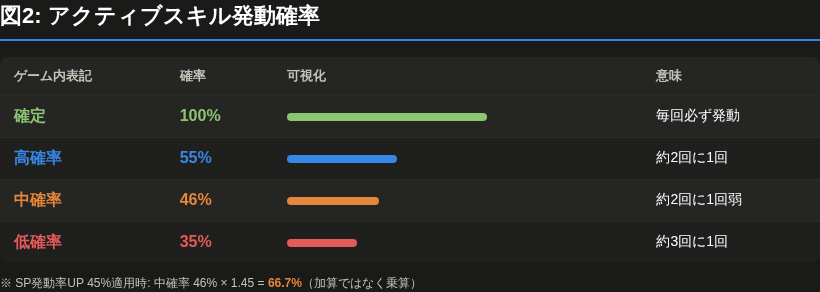
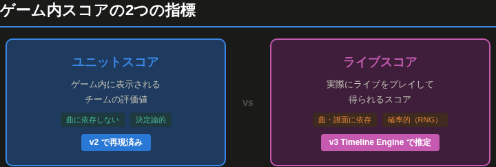
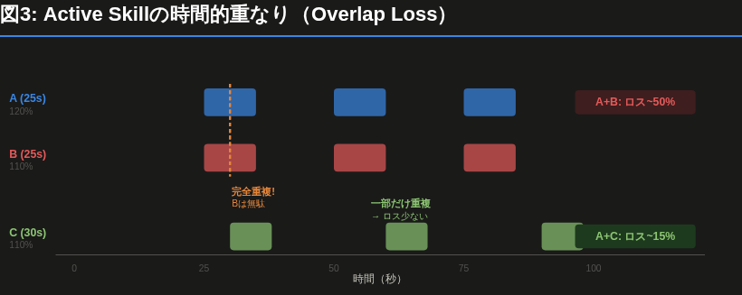
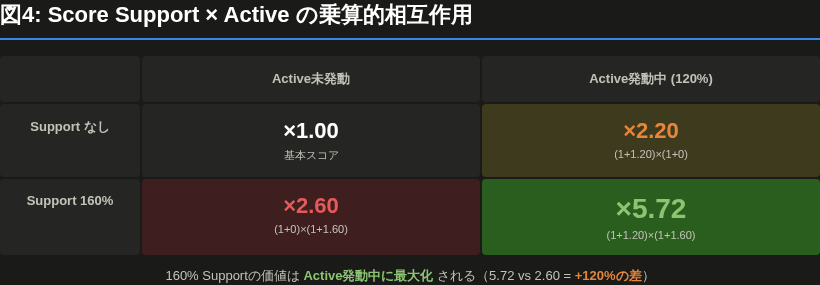
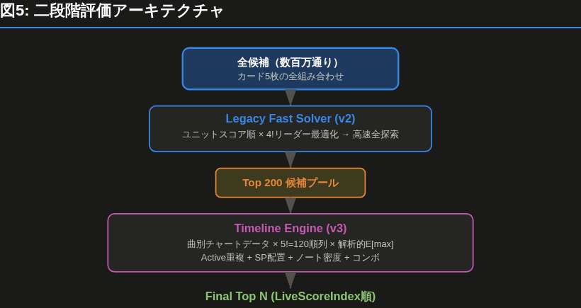

# HoloSolve スコア計算 完全ガイド

ホロライブドリームス（ホロドリ）のスコア計算メカニズムを実測解明し、最適編成を探索するHoloSolveの技術資料。ゲーム内ユニットスコアの再現（v2）と、曲別ライブ期待スコアの解析計算（v3 Timeline Engine）の両方を解説する。

---

## 目次

0. [スキル効果の分類と用語](#0-スキル効果の分類と用語)
1. [スコアの全体構造](#1-スコアの全体構造)
2. [ユニットスコアの計算式](#2-ユニットスコアの計算式)
3. [総合力の計算](#3-総合力の計算)
4. [スコアボーナスの計算](#4-スコアボーナスの計算)
5. [アクティブスキル — Expected Maximumモデル](#5-アクティブスキル--expected-maximumモデル)
6. [スペシャルスキル — 発動率UP・スコアサポート](#6-スペシャルスキル--発動率up・スコアサポート)
7. [ユニットスコアの限界 — なぜv3が必要か](#7-ユニットスコアの限界--なぜv3が必要か)
8. [v3 Timeline Engine — ライブ期待スコア](#8-v3-timeline-engine--ライブ期待スコア)
9. [Active Skillの時間的重なり](#9-active-skillの時間的重なり)
10. [Score Support × Active の相互作用](#10-score-support--active-の相互作用)
11. [SP固定5地点と編成順の最適化](#11-sp固定5地点と編成順の最適化)
12. [ノート密度とコンボボーナス](#12-ノート密度とコンボボーナス)
13. [二段階評価アーキテクチャ](#13-二段階評価アーキテクチャ)
14. [Monte Carlo検証](#14-monte-carlo検証)
15. [定数一覧](#15-定数一覧)
16. [キャリブレーション](#16-キャリブレーション)

---

## 0. スキル効果の分類と用語

ホロドリには複数の「スコアが上がる効果」があるが、それぞれ**作用する場所と仕組みが全く異なる**。名前が似ていても混同すると編成を間違える。

### 効果の全体マップ



### 各効果の詳細

#### ① パラメータUP — 衣装スキル（リーダースキル）

**リーダーの衣装**がチーム全体のステータスを倍率で強化する。**総合力**に直接乗る。

| 表記 | 効果 | 現存カードの値 |
|---|---|---|
| 全パラメータ○%UP | 全ステに倍率 | 30%, 45%, **50%** |
| パフォーマンス○%UP | パフォのみに倍率 | 80%, 120%, 130%, **135%** |
| テクニック○%UP | テクニックのみに倍率 | 80%, 120%, 130%, **135%** |
| センス○%UP | センスのみに倍率 | 80%, 120%, 130%, **135%** |

> 一見「全パラ50%」が最強に見えるが、チームのステ偏りによっては「パフォ135%」の方が強いことがある（詳細はセクション3.2）。

#### ② パラメータUP — パッシブスキル（サポートスキル）

各カードが持つスキルで、**特定の条件を満たすチームメンバー**のステータスを加算する。

| 種類 | 効果 | 値の範囲 |
|---|---|---|
| 自分の全パラ○%UP | 自分自身の全ステ×N% | 24〜33% |
| 同タイプの○パラ○%UP | 同タイプのN人に特定ステ×M% | 30〜43% |
| 同グループの○パラ○%UP | 同グループのN人に特定ステ×M% | 32〜45% |

**重要**: 対象は**配列の先頭から順に**選ばれる。カードの並び順を変えるとバフ対象が変わる。

#### ③ スコアサポート — 衣装スキル

リーダー衣装にスコアサポート効果が付く場合がある。**スコアボーナス**に `値 × 0.68` として加算。

| 表記 | 現存カードの値 | スコアボーナスへの寄与 |
|---|---|---|
| スコアサポート○%UP | 25%, 60% | 17.0%, 40.8% |

#### ④ スコアUP — アクティブスキル（センタースキル）

ライブ中に**一定間隔で確率的に発動**し、一定時間スコアを上げる。**5人中最大のもののみ有効**（重複しない）。

| パラメータ | 意味 | 値の範囲 |
|---|---|---|
| スコアUP | 発動中のスコア上昇量(%) | 45〜**125%** |
| 発動間隔 | 何秒ごとに発動判定 | 15〜35秒 |
| 効果時間 | 発動後の持続秒数 | 6〜15秒 |
| 発動確率 | 発動判定の成功率 | 下表参照 |

**発動確率の具体値**:



| ゲーム内表記 | permil値 | 実際の確率 | 備考 |
|---|---|---|---|
| **確定** | 1000 | **100%** | 必ず発動 |
| **高確率** | 550 | **55%** | 約2回に1回 |
| **中確率** | 460 | **46%** | 約2回に1回弱 |
| 低確率 | 350 | **35%** | 約3回に1回 |

> 「高確率」と「中確率」の差はわずか9%だが、uptime計算に掛け算で効くため編成全体への影響は大きい。

**条件付きスコアUP**: 一部のカードは条件成立時にスコアUPが強化される。

| 条件 | 意味 | AP前提での扱い |
|---|---|---|
| `happy_2` / `pure_2` / `cute_2` | 同タイプ2人以上 | チーム構成から判定 |
| `life_600` | ライフ600以上 | 常に成立 |
| `combo_40` | 40コンボ以上 | 常に成立 |

#### ⑤⑥ スコアサポート — パッシブスキル

パッシブに付くスコアサポート効果。**スコアボーナス**に `値 × 0.20` として加算。

| 種類 | 条件 | 値の範囲 |
|---|---|---|
| 同タイプスコアサポート | 同タイプN人以上 | 8〜11% |
| 同グループスコアサポート | 同グループN人以上 | 9〜12% |

> 衣装SS（×0.68）に比べてパッシブSS（×0.20）は変換率が低い。パッシブSSに頼るより高ステ・高Activeのメンバーを入れた方がスコアは伸びやすい。

#### ⑦ スコアサポート — スペシャルスキル

SPが持つスコアサポート。ライブ中の**固定地点で一定時間発動**し、その間のスコアを上げる。

| パラメータ | 意味 | 値の範囲 |
|---|---|---|
| スコアサポート | 効果量(%) | 95〜**160%** |
| 効果時間 | 持続秒数 | 10〜14秒 |

> **ユニットスコアでの扱い**: 曲長で時間平均される（`score_support × duration / song_length`）。
> **ライブでの実態**: Score SupportはActive Score UPと**乗算で作用**する。160% Supportは、Active発動中は極めて強力だが、Active未発動中は効果が薄い（詳細はセクション10）。

#### ⑧ 発動率UP — スペシャルスキル

SPに付随する効果。Activeスキルの発動確率を**乗算で**上げる。

| パラメータ | 意味 | 値の範囲 |
|---|---|---|
| 発動率UP | 確率上昇量(%) | 35〜**55%** |
| 条件 | 発動条件 | なし / `life_1000` / `combo_100` |

```
例: 中確率(46%) のActiveに 発動率UP 45% が適用
  → 46% × (1 + 0.45) = 46% × 1.45 = 66.7%

  ※ 加算ではない: 46% + 45% = 91% にはならない
```

| 条件 | 意味 | AP前提での扱い |
|---|---|---|
| なし | 無条件で発動 | 常に有効 |
| `life_1000` | ライフ1000以上 | 常に有効（AP前提） |
| `combo_100` | 100コンボ以上 | 常に有効（AP前提） |

### 効果の相互関係まとめ

```
パラメータUP ──→ 総合力を上げる（加算的）
                    │
                    ├─ 衣装: チーム全体に倍率
                    └─ パッシブ: 条件付きで個別に加算

スコアUP ──→ スコアボーナスを上げる
  (Active)     │
               ├─ 確率的に発動（RNGあり）
               ├─ 5人中最大のみ有効（重複無効）
               └─ 発動率UPで確率が上がる

スコアサポート ──→ スコアボーナスを上げる（ユニットスコア計算時）
                   ──→ Active Score UPを増幅する（ライブスコア計算時）
                   │
                   ├─ 衣装SS: 常時有効, 変換率 ×0.68
                   ├─ パッシブSS: 条件付き常時, 変換率 ×0.20
                   └─ SP SS: 曲中の固定地点で一時的, 変換率 ×(時間平均)

発動率UP ──→ Active発動確率を上げる（間接的にスコアUPを上げる）
  (SP)       │
             └─ 乗算で適用: base × (1 + rate_up)
```

---

## 1. スコアの全体構造

ホロドリのスコアには2つの異なる指標がある。



**ユニットスコア**はカード構成だけで決まる静的な値。**ライブスコア**はそれに加えて曲の譜面、スキル発動のRNG、ノート判定が影響する動的な値。

---

## 2. ユニットスコアの計算式

```
ユニットスコア = 総合力 × (1 + スコアボーナス%) × K
```

- **総合力**: チームの基礎戦力（パラメータ + スキルバフ）
- **スコアボーナス**: スキルによるスコア倍率の合計（%単位）
- **K = 2.0373**: ゲーム内定数

この3つは**完全に独立**しており、乗算で結合される。

```
例:
  総合力 = 156,040
  スコアボーナス = 113.4%
  ユニットスコア = 156,040 × (1 + 1.134) × 2.0373
               = 156,040 × 2.134 × 2.0373
               = 678,413
```

### 定数 K = 2.0373 の由来

ゲーム公式のデッキ評価係数は **K=2.3**（HolodoriDB `Setting.json` の `liveDeckEvaluationCoefficientPermilMultiply = 2300`）。HoloSolveの **K=2.037** はこの2.3に曲別スコア係数、コンボボーナス、ノート種別係数を圧縮した経験値。5チーム構成で検証し誤差0.001%以内で安定。

---

## 3. 総合力の計算

```
総合力 = メンバーパラメータ + 衣装スキル + パッシブスキル + ベースライン
```

### 3.1 メンバーパラメータ

5人のステータス合計にstat_scaleを掛けたもの。

```
メンバーパラメータ = (Σ パフォーマンス + Σ テクニック + Σ センス) × stat_scale
```

各ステータスはカードの凸・レベルで変動する:

```
stat = ceil(base_value × permil × (1000 + param_bonus_permil) / 1,000,000)
```

- `base_value`: レベルテーブルから取得（Lv80で最大）
- `permil`: カード固有のステ配分比率（3ステの合計が1000）
- `param_bonus_permil`: 凸ボーナス（2凸以上で+100 = +10%）

### 3.2 衣装スキル（リーダースキル）

リーダーの衣装がチーム全体のステータスにバフを掛ける。

```
衣装寄与 = パフォ合計 × パフォ率 + テク合計 × テク率 + センス合計 × センス率
```

衣装バフは**ステごとに適用**される:
- 「全パラ50%UP」→ 全ステに50%
- 「パフォーマンス135%UP」→ パフォのみに135%

> **重要な発見**: パフォ比率42%以上のチームでは「パフォ135%UP」が「全パラ50%UP」を上回る。
> 42% × 135% = 56.7% > 50%

### 3.3 パッシブスキル（サポートスキル）

各カードのパッシブが**配列順に**ターゲットへバフを付与する。

```
パッシブ寄与 = Σ(対象カードのステ × バフ率) × stat_scale
```

バフ種類:
- `self_all_param`: 自分の全ステ×N%
- `type_stat`: 同タイプのN人に特定ステ×M%（**配列順で適用**）
- `group_stat`: 同グループのN人に特定ステ×M%

> **配列順が重要**: パッシブは先頭から順にターゲットを選ぶ。カードの並び順を変えるとバフ対象が変わり、総合力が変わる。

### 3.4 ベースライン

キャリブレーションで算出される定数。メモリー効果やボード育成など、データベースにない要素を吸収する。

---

## 4. スコアボーナスの計算

```
スコアボーナス(%) = アクティブ% + 衣装SS% + パッシブSB% + スペシャル%
```

| 項目 | 計算式 | 典型値 |
|---|---|---|
| アクティブ | `52.89 + E[max] / 12.82` | 55〜70% |
| スペシャル | `Σ(SS効果% × 秒数) / 曲長` | 25〜40% |
| 衣装SS | `衣装SS値 × 100 × 0.68` | 0〜17% |
| パッシブSB | `サポートSS合計 × 100 × 0.20` | 2〜7% |

アクティブスキルが**支配的**で、スコアボーナス全体の50%以上を占める。

---

## 5. アクティブスキル — Expected Maximumモデル

### 5.1 なぜExpected Maximum？

ゲーム仕様:
> **複数のアクティブスキルが同時に発動している場合、最も効果量の高いもののみ有効**

つまり5人のActiveの合計ではなく、**最大値のみ**がスコアに貢献する。

### 5.2 各カードのUptime

各カードのActiveは一定周期で確率的に発動し、一定時間持続する。

```
uptime = min(1, duration / interval × boosted_prob)
```

- `interval`: 発動間隔（秒）。例: 25秒ごとに判定
- `duration`: 効果持続時間（秒）。例: 10秒間有効
- `boosted_prob`: ブースト後の発動確率

```
例: interval=25, duration=10, prob=45%
  uptime = 10/25 × 0.45 = 0.18 (18%の時間Active中)
```

### 5.3 発動確率のブースト（乗算方式）

SP発動率UPは**乗算で適用**される（v3で修正）。

```
boosted_prob = base_prob × (1 + rate_up_avg)

rate_up_avg = Σ(SP発動率UP/100 × SP効果秒数 / 曲長)
```

```
例: Medium (45%) + SP Rate UP 45% (10秒/120秒曲)
  rate_up_avg = 0.45 × 10/120 = 0.0375
  boosted_prob = 0.45 × 1.0375 = 0.4669

  ※ 旧方式(加算): 0.45 + 0.0375 = 0.4875 ← 過大評価
```

### 5.4 Expected Maximum計算

5人をscore_up降順にソートし、「それより強い全員が不発の確率」を掛ける:

```
E[max] = Σ(score_up_i × uptime_i × Π_{j<i}(1 - uptime_j))
```

```
例: 3人のActive
  A: 120%, uptime=0.30
  B: 110%, uptime=0.25
  C:  80%, uptime=0.20

  E[max] = 120 × 0.30 × 1.00          ← Aが発動 (確率30%)
         + 110 × 0.25 × (1-0.30)       ← Aが不発でBが発動
         + 80  × 0.20 × (1-0.30)(1-0.25) ← A,Bが不発でCが発動
         = 36.00 + 19.25 + 8.40
         = 63.65
```

最終的に:
```
アクティブ% = 52.89 + 63.65 / 12.82 = 57.85%
```

### 5.5 同倍率Activeの処理

同じscore_upのカードが複数あっても正しく計算される:

```
A = 120%, p=0.5
B = 120%, p=0.5

E[max] = 120 × 0.5 × 1.0     ← Aが発動
       + 120 × 0.5 × (1-0.5)  ← Aが不発でBが発動
       = 60 + 30 = 90

これは 120 × P(AまたはB) = 120 × (1 - 0.5×0.5) = 90 と一致
```

---

## 6. スペシャルスキル — 発動率UP・スコアサポート

スペシャルスキルは2つの効果を持つ:

### 6.1 スコアサポート

曲全体での時間平均:
```
スペシャル% = Σ(score_support × duration) / song_length
```

### 6.2 スキル発動率UP

Active Skillの発動確率を上げる。**乗算方式**:
```
boosted_prob = base_prob × (1 + total_rate_up)
```

複数のSP発動率UPは先に合算:
```
例: SP1 = +45%, SP2 = +50%
  total_rate_up = 0.45 + 0.50 = 0.95
  boosted_prob = 0.45 × (1 + 0.95) = 0.45 × 1.95 = 0.8775
```

### 6.3 条件付きスキル

一部のSPには発動条件がある:
- `life_1000`: ライフ1000以上で発動 → AP前提なら常に成立
- `combo_100`: 100コンボ以上で発動 → AP前提なら常に成立

---

## 7. ユニットスコアの限界 — なぜv3が必要か

ユニットスコアは**曲に依存しない静的な評価値**であり、実際のライブスコアとは以下の点で乖離する:

### 7.1 Active重複の評価漏れ

ユニットスコアでは各Activeの**時間平均uptime**でE[max]を計算する。しかし実際には:



**同じscore_up、同じuptime**でも、**周期の組み合わせ**によってスコアが大きく変わる。ユニットスコアではこの差が見えない。

### 7.2 Score SupportとActiveの相互作用

実ゲームでは:
```
ノートスコア ∝ (1 + Active Score Up) × (1 + Score Support)
```

Score Support（160%等）は**Active発動中にのみ大きな効果を持つ**:

```
Active発動中:   (1 + 1.20) × (1 + 1.60) = 2.20 × 2.60 = 5.72倍
Active未発動:   (1 + 0.00) × (1 + 1.60) = 1.00 × 2.60 = 2.60倍
差:                                                       +3.12倍
```

ユニットスコアでは Score Support を時間平均で独立に扱うため、この相互作用が失われる。

### 7.3 SP発動位置と編成順

SPは**曲ごとに固定された5地点**で発動し、**編成スロット順**で割り当てられる:

```
スロット1のカード → SP地点1で発動
スロット2のカード → SP地点2で発動
    ：
スロット5のカード → SP地点5で発動
```

ノート密集地点にScore Support 160%のSPを置くか、閑散地点に置くかでスコアが大きく変わる。ユニットスコアにはこの情報がない。

---

## 8. v3 Timeline Engine — ライブ期待スコア

### 8.1 解析的期待値計算

Monte Carloシミュレーション**不要**。期待値の線形性を利用:

```
E[総スコア] = Σ E[ノート_i のスコア]
```

各ノート時刻でのActive発動状態は確率的だが、**期待値の合計**だけなら各ノートの期待値を独立に計算して足せばよい。

### 8.2 各ノート時刻での計算

時刻tにおけるActive期待値:

```
1. 各カードについて、時刻tを覆うActive Windowを特定
2. p_i(t) = 1 - Π(1 - q_j) for all attempts j covering t
3. E[max(t)] = Σ(value_i × p_i(t) × Π_{j<i}(1 - p_j(t)))
```

```
┌──────── 時刻t=55秒での状態 ────────┐
│                                     │
│  カードA: Active Window [50,60)     │
│    → 発動確率 q=0.65               │
│    → p_A(55) = 0.65               │
│    → score_up = 120%               │
│                                     │
│  カードB: Active Window [50,58)     │
│    → 発動確率 q=0.45               │
│    → p_B(55) = 0.45               │
│    → score_up = 110%               │
│                                     │
│  E[max] = 120×0.65                 │
│         + 110×0.45×(1-0.65)        │
│         = 78.00 + 17.33            │
│         = 95.33                    │
└─────────────────────────────────────┘
```

### 8.3 LiveScoreIndex

```
LiveScoreIndex = TotalPower × RelativeSongScore

RelativeSongScore = Σ(noteWeight × comboMultiplier × skillMultiplier)

skillMultiplier(t) = (1 + E[max_active(t)]/100) × (1 + totalSupport(t)/100)
```

LiveScoreIndexは**同一曲内での編成比較**に使う相対指標。ゲーム内絶対スコアとは直接比較不可（曲固有の定数が未知のため）。

---

## 9. Active Skillの時間的重なり

### 9.1 Active Overlap Loss

「重複がなければ得られたはずのスコア」と「実際のE[max]」の差:

```
rawExposure(t) = Σ(score_up_i × p_i(t))    ← 重複無視の合計
actualExposure(t) = E[max(t)]                ← 実際の期待値

overlapLoss = 1 - Σ actualExposure / Σ rawExposure
```

```
例: Active overlap loss = 30%
  → 5人のActiveの30%が他のActiveと被って無駄になっている
```

### 9.2 周期差による影響

| カード構成 | 周期 | Overlap Loss | 備考 |
|---|---|---|---|
| A(25s) + B(25s) | 同周期 | ~50% | 常に被る |
| A(25s) + C(30s) | 微差 | ~15% | 一部被る |
| A(25s) + D(20s) | 大差 | ~8% | ほぼ被らない |

**ユニットスコアが同じでも、周期の組み合わせでライブスコアが数%変わる。**

---

## 10. Score Support × Active の相互作用

### 10.1 乗算的関係

```
ノートのスキル倍率 = (1 + Active%) × (1 + Support%)
```

Support単体の価値はActiveの有無に大きく依存:



### 10.2 SP効率（SP Efficiency）

各SPスロットで「その時間帯にどれだけActiveが発動しているか」を計測:

```
SP効率 = SP区間内の E[max active] の平均
```

```
例:
  SP1 (slot1, t=13-23s): SP効率 = 21.7  ← Activeが少ない時間帯
  SP2 (slot2, t=32-42s): SP効率 = 70.8  ← Activeが多い時間帯
  → 160% Supportはslot2に配置すべき
```

---

## 11. SP固定5地点と編成順の最適化

### 11.1 SPの発動メカニズム

```
曲ごとに固定された5地点でSPが発動する

例: m0001_expert (Shiny Smily Story)
  SP1: 13.25秒
  SP2: 32.39秒
  SP3: 48.59秒
  SP4: 64.79秒
  SP5: 80.98秒
```

### 11.2 5! = 120通りの全探索

リーダー（衣装）はメンバー順とは独立。5人全員の順列を探索:

```
slot1: カードA → SP地点1でAのSPが発動
slot2: カードB → SP地点2でBのSPが発動
  ：
```

最適な配置:
- **Score Support 160%** → ノートが密集しActiveが活発な地点に配置
- **Score Support 30%** → ノートが少ない地点でも影響小
- **Rate UP 45%** → Active triggerと重なる地点に配置

---

## 12. ノート密度とコンボボーナス

### 12.1 ノートタイプ別ウェイト

| タイプ | permil | 倍率 |
|---|---|---|
| 通常タップ | 1000 | ×1.00 |
| フリック | 1050 | ×1.05 |
| スライド開始 | 1000 | ×1.00 |
| スライド終了 | 1000 | ×1.00 |
| スライド中継 | 100 | ×0.10 |
| スライド継続 | 100 | ×0.10 |

### 12.2 コンボボーナス

AP（All Perfect）前提ならコンボは決定論的:

| コンボ数 | ボーナス |
|---|---|
| 0〜99 | +0% |
| 100〜199 | +1% |
| 200〜299 | +2% |
| ... | ... |
| 900〜999 | +9% |
| 1000〜 | +10%（最大） |

**曲後半ほどコンボボーナスが高い**ため、強いSPを後半に置く方が有利。

---

## 13. 二段階評価アーキテクチャ



**Legacy Solverは一切変更しない。** Timeline Engineは候補の「仕上げ」として使う。

---

## 14. Monte Carlo検証

Timeline Engineの解析解が正しいことを検証するためのoracle:

```
for trial in 100,000回:
    各Active attemptをランダムに成功/失敗させる
    実タイムラインでスコアを計算

MC平均 ≒ 解析的期待値
```

実測結果:

| ケース | 解析値 | MC平均 | 差 |
|---|---|---|---|
| 単一カード p=1.0 | 完全一致 | 完全一致 | 0% |
| 単一カード p=0.5 | 11,800,000 | 11,798,968 | 0.009% |
| 2カード重複 | 15,957,200 | 15,951,194 | 0.038% |
| SP Rate UP + Support | 15,515,800 | 15,509,510 | 0.041% |

全ケースで**0.05%未満**。Monte Carloは本番評価には使わず、テスト専用。

---

## 15. 定数一覧

### ゲーム由来の定数

| 定数 | 値 | ソース |
|---|---|---|
| デッキ評価係数 (公式) | 2.3 (2300 permil) | HolodoriDB Setting.json |
| コンボボーナス上限 | +10% (100 permil) | HolodoriDB LiveCombo.json |
| フリック係数 | 1.05 (1050 permil) | HolodoriDB LiveNote.json |
| SP発動地点数 | 5 | ゲーム仕様（SUSファイルより） |

### HoloSolve経験定数

| 定数 | 値 | 用途 |
|---|---|---|
| UNIT_SCORE_K | 2.0373 | ユニットスコア係数（コンボ等を圧縮した近似値） |
| ACTIVE_BASE | 52.89 | アクティブ%のベースライン |
| ACTIVE_DIVISOR | 12.82 | E[max]のスケーリング |
| COSTUME_SS_RATE | 0.68 | 衣装Score Supportの変換率 |
| SUPPORT_SS_RATE | 0.20 | パッシブScore Supportの変換率 |

### 発動確率テーブル

| 表記 | permil | 確率 |
|---|---|---|
| Very High | 1000 | 100% |
| High | 550 | 55% |
| Medium | 460 | 46% |
| Medium (旧) | 450 | 45% |
| Low | 350 | 35% |

---

## 16. キャリブレーション

ゲーム内ステータスはボード育成で変動するため、2点キャリブレーションで補正する。

同じ5人でリーダーを変えた2回のユニットスコアから`stat_scale`と`baseline`を算出:

```
game_score_1 = f(stat_scale, baseline, leader_1の衣装)
game_score_2 = f(stat_scale, baseline, leader_2の衣装)
```

2衣装の差分から連立方程式を解く:

```
stat_scale = (target_1 - target_2) / (costume_diff)
baseline = target_1 - (raw_total + costume + support) × stat_scale
```

キャリブレーションはユニットスコア（v2）専用。ライブ期待スコア（v3）は相対順位比較のみなので補正不要。

---

## 変更履歴

| バージョン | 変更内容 |
|---|---|
| v1 | Σ線形和で全員のActiveを合算、発動率無視 |
| v2 | Expected Maximumモデル、発動率考慮、SP発動率UP加算方式 |
| v3 | SP発動率UP乗算方式、Timeline Engine（曲別期待スコア）、5!順列探索、Active重複ロス可視化 |
